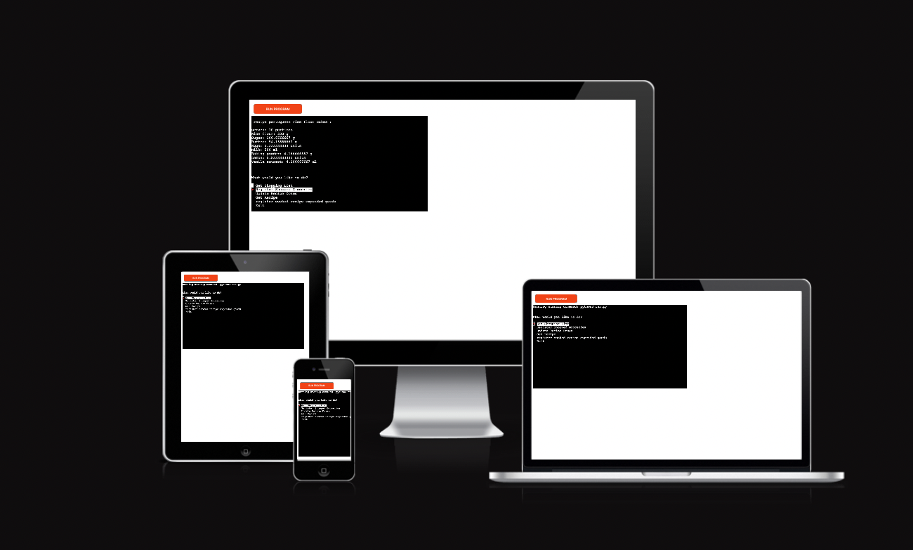

# BakeBakery App - README

*The link to [Bakery Bake](https://bakery-bake-83c76bb3649a.herokuapp.com/)*

## Introduction

The BakeBakery App is a Python terminal-based application designed to help users manage recipes, pantry goals, and shopping lists for a bakery. It allows users to interact with recipes, update pantry goals based on recipes, get shopping lists, register shopped groceries, and more.

## Features

### Recipe Management

View recipes for various baked goods, including croissants, pastel de nata, Portuguese rice flour cakes, and brownies.
Print detailed ingredient lists for each recipe.

### Pantry Goals

Update pantry goals automatically when updating the intended servings of a recipe. The app automatically adds ingredients from all recipes and a 20% safety increase to each ingredient on pantry goals.

### Recipe Doses

Update recipe doses by multiplying ingredient amounts based on the number of servings entered by the user.

### Get Shopping List

Get a shopping list by subtracting pantry amounts from pantry goal amounts.

### Shopped Groceries

Register shopped groceries by entering the amounts of various ingredients.

### Cooked Recipe

Register cooked recipes to subtract expended ingredients from the pantry.

### Clear Terminal

Automatically clears the terminal screen for a cleaner interface, when one is finished with an action.

### User-Friendly Menu

The application provides a user-friendly menu with options to perform various actions.

## How to Use

Click the link to [Bakery Bake](https://bakery-bake-83c76bb3649a.herokuapp.com/) or past 'https://bakery-bake-83c76bb3649a.herokuapp.com/' in your browser.
Navigate through the menu using arrow keys and Enter.
Choose actions such as getting a shopping list, updating recipe doses, registering shopped groceries, or registering cooked recipes.
Follow on-screen prompts to input necessary information.

## Technologies

### Languages:

Python 3.8.5: Used to write the whole app

### Dependencies

Heroku: used as a terminal to deploy the app.
Google Sheets API library for accessing and modifying Google Sheets.
google-auth: Google Authentication library.
simple-term-menu: Library for creating terminal-based menus.

### Standard library imports:

[os](https://docs.python.org/3/library/os.html ) was used to clear the terminal before running the program.

### Other tools:

[VSCode](https://code.visualstudio.com/) was used as the main tool to write and edit code.
[GitHub](https://github.com/) was used to host the code of the website.

## Deployment

### Clone the repository to your local machine:

`git clone https://github.com/your-username/BakeBakery.git`

### Install the required dependencies:

pip install gspread google-auth simple-term-menu

### Set up Google Sheets API:

Follow the instructions in the gspread documentation to create and download a service account key in JSON format.

Place the downloaded JSON key file in the project directory and name it creds.json.

Create a Google Sheets document and name it 'BakeryBake'. Share it with the email address provided in the client_email field of the creds.json file.

### Run the run.py script:

python run.py

## Contributors

Dinis Machado

## Credits

    Google Sheets
    Code institute walk through

## Acknowledgments

I am enormously thankful to my mentors Juliia Konn and Alex K. for their guidance and valuable feedback!
